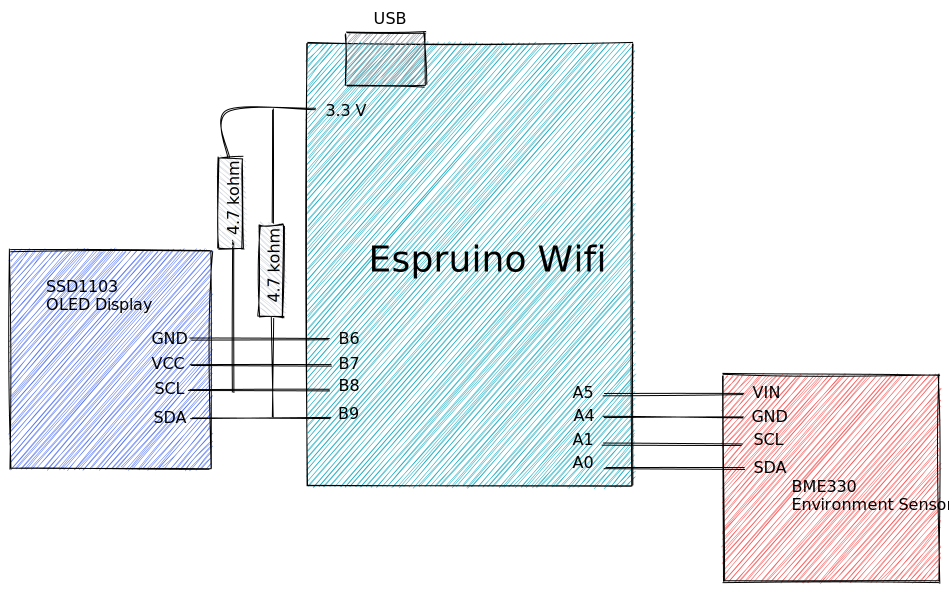
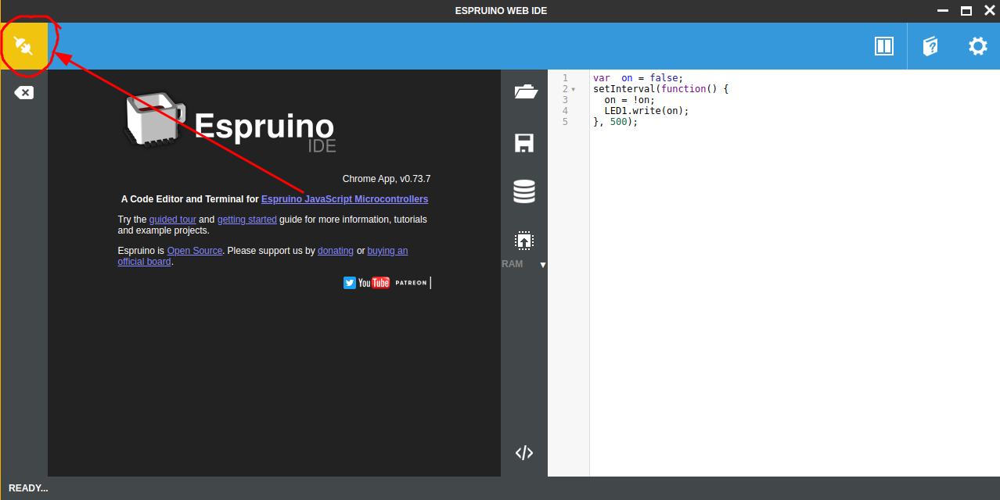
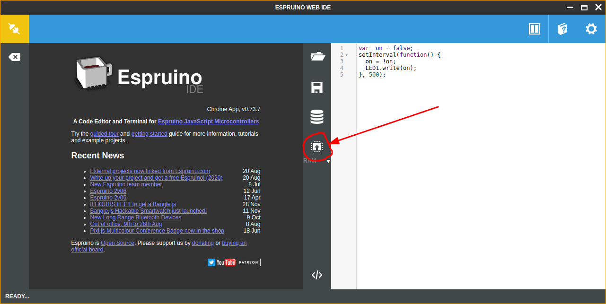

# Espruino Weather Station

[Espruino](https://www.espruino.com/) is a project that combines small, powerful, and efficient microcontrollers with a JavaScript runtime.

For this course, we will use an [Espruino Wifi](https://www.espruino.com/WiFi), a [BME280 Environment Sensor](https://www.espruino.com/BME280) (temperature, humidity, and atmospheric pressure), and a [SSD1306 OLED](https://www.espruino.com/SSD1306) display. We will combine all of these components to create a weather station running JavaScript!


The weather station records the temperature, humidity, and atmospheric pressure. The data can then be used to monitor and predict the weather.

The components are combined as illustrated below:


<p align="center"><strong>CPINFO Espruino Circuit Diagram</strong></p>


## 1 Get Connected

1. Connect your Espruino board to the USB port of the computer. Wait for Windows to indicate the drivers were correctly installed.
1. Install the [Espruino Web IDE](https://chrome.google.com/webstore/detail/espruino-web-ide/bleoifhkdalbjfbobjackfdifdneehpo) and open it.
1. Connect to your Espruino board by clicking on connect icon and choosing the `Espruino` connection:
   
1. Click on the Run button to execute the code that is shown on the right half of the screen:
   

   You can modify the code on the right half of the screen and then click the Run button again to see the changes live. You can also execute `console.log("hello CPINFO")` to log messages and data to the console of the left half of the screen.

## 2 OLED Display

The SSD1306 OLED is a 128x64 resolution monochrome OLED display. It communicates with the Espruino using a SPI protocol. Fortunately, this is already supported by Espruino.

1. Setup the display by adding the following code to your project:
   ```javascript
   let display;
   function setupDisplay() {
     I2C1.setup({scl: B8, sda: B9});
     B7.set();
     B6.reset();
     display = require('SSD1306').connect(I2C1, displayReady);
   }

   function displayReady() {
     display.drawString("Hello CPINFO");
     display.flip();
   }

   setupDisplay();
   ```

   The graphics library on Espruino allows changing the [font](https://www.espruino.com/Graphics#text-fonts), [drawing lines](https://www.espruino.com/Graphics#random-lines), [shapes](https://www.espruino.com/Graphics#circles), and [much more](https://www.espruino.com/Reference#Graphics).

1. `clear()` and `flip()`

   The Espruino [Graphics](https://www.espruino.com/Graphics) library lets us use "double buffering" to write to the display. First, we draw to a local variable (buffer) then we call the `flip()` function to write the buffer to the display. The function `clear()` clears the buffer.

   Double buffering techniques reduce flickering when drawing animations on a display.

1. Refresh with `setInterval()`

   The function [setInterval()](https://www.espruino.com/Reference#l__global_setInterval) allows executing a function at regular intervals. For example the following code will log a message every second (1000ms):

   ```javascript
   let count = 0;
   setInterval(() => {
     console.log('The count is:', count);
     count = count + 1;
   }, 1000);
   ```
#### ☑️ Exercise 2.1 Use `setInterval()` to update the display with some changing text or shapes.

### 📖 Reference

* [Espruino Graphics Tutorial](https://www.espruino.com/Graphics)
* [Espruino Graphics Reference](https://www.espruino.com/Reference#Graphics)
* [Espruino SSD1306 OLED Driver](https://www.espruino.com/SSD1306)
* [Espruino `setInterval()`](https://www.espruino.com/Reference#l__global_setInterval)
* [JavaScript `setInterval()` Reference](https://developer.mozilla.org/en-US/docs/Web/API/WindowOrWorkerGlobalScope/setInterval)

## 3 BME280 Environment Sensor

1. Setup the environment sensor by adding the following code to your project:
   ```javascript
   let sensor;
   function setupSensor() {
     A4.reset();
     A5.set();

     console.log('Starting Temp');
     const i2c = new I2C();
     i2c.setup({scl: A1, sda: A0});
     sensor = require('BME280').connect(i2c);
   }

   setupSensor();

   const data = sensor.getData();
   console.log('Temp:', data.temp);
   console.log('Humidity:', data.humidity);
   console.log('Pressure:', data.pressure);
   ```

#### ☑️ Exercise 3.1 Instead of displaying the data on the console, we should display it on the OLED dislplay! Use the `drawString()` functions to read the data from the sensor and display it on the OLED display.

#### ☑️ Exercise 3.2: use setInterval to read the temperature and update the display

#### ☑️ Bonus: Use the Graph library to draw cool graphs!!!

### 📖 Reference

* [Espruino BME280 Driver](https://www.espruino.com/BME280)
* [Espruino Graph Library](https://www.espruino.com/graph) (for drawing graphs)

## 4 Wifi

1. The following code allows connecting to a wifi access point:

   ```javascript
   const WIFI_NAME = "cpinfo";
   const WIFI_OPTIONS = { password : "javascript" };

   let wifi;
   function connectWifi() {
     wifi = require("Wifi");
     wifi.connect(WIFI_NAME, WIFI_OPTIONS, function(err) {
       if (err) {
         console.log("Connection error: "+err);
         return;
       }

       wifi.getIP((err, addr) => {

         if (err) {
           console.log("IP error: "+err);
           return;
         }

         console.log("Connected!", addr.ip);
       });
     });
   }

   connectWifi();
   ```

### 📖 Reference

* [Espruino WiFi Reference](https://www.espruino.com/WiFi#using-wifi)

## 5 Server

1. Once we are connected to wifi, we can serve a page over http. Add the following line just after `console.log("Connected!", addr.ip);` from the previous section:

   ```javascript
   require("http").createServer(pageRequest).listen(80); // port 80
   ```

1. Now add the request handler to return an html page:

   ```javascript
   function pageRequest(req, res) {
     res.writeHead(200, {'Content-Type': 'text/html'});
     res.end(`
   <html>
     <body>
       <h1>Hello CPINFO</h1>
       The current time is ${new Date().toString()}
     </body>
   </html>`);
   }
   ```

   Notice that the inside the ` quotes, you can execute JavaScript to create dynamic strings. These are called template strings.

#### ☑️ Exercise 5.1: Customize the page to return the current temperature, humidity, pressure.

#### ☑️ Exercise 5.2: Imagine saving a history of the weather data... modify the program to record a log of data and return the data in the response. Consider adding a JavaScript graphing library such as [chart.js](https://www.chartjs.org/) into the HTML page.

### 📖 Reference

* [Espruino Web Server](https://www.espruino.com/Internet#server)
* [Espruino Handling POST'ed forms](https://www.espruino.com/Posting+Forms)
* [Espruino HttpSrv](https://www.espruino.com/Reference#httpSrv)
* [Espruino HttpSRq](https://www.espruino.com/Reference#httpSRq)
* [Espruino HttpSRs](https://www.espruino.com/Reference#httpSRs)

## 6 API

We can also serve multiple pages (routes) by parsing the URL sent to the Espruino.

1. Inside the `pageRequest()` function add a route to get the live weather data:
   ```javascript
   function pageRequest(request, res) {
     const a = url.parse(request.url, true);

     if (a.pathname === '/') {
       res.writeHead(200, {'Content-Type': 'text/html'});
       res.end(`
       <html>
        <!-- ... -->
       </html>`);
     } else if (a.pathname === '/data') {
       // ...
     }
   }
   ```

#### ☑️ Exercise 6.1: Complete the `/data` route to return the live weather data from your Espruino weather station.
* You will need to use the content type `application/data` to send JSON data.
* Be sure to call `JSON.stringify()` on your data to convert it to JSON.

#### ☑️ Bonus: Add another route `/history` to get the historic data.
