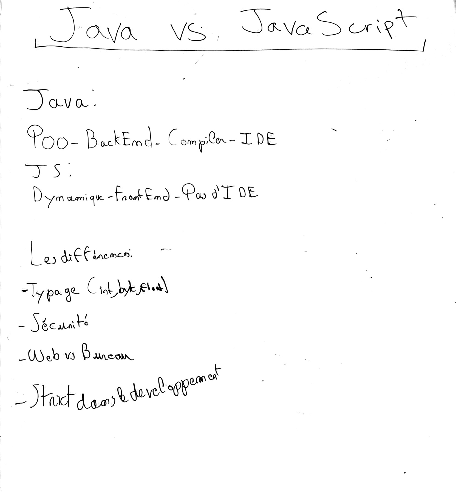

# 1 Java vs JavaScript




| |java|javascript|
|-|-|-|
|**Execution**|bytecode executed in JVM|script interpreted|
|**Compilation**|source code compiled to byte code (type checking)|sometimes transformed and/or compressed (minimized), but compilation not necessary|
|**Types**|statically typed|dynamically typed|
|**Numeric types**|byte, short, int, long, float, double|Number, BigInt|
|**Portability**|"write once, run anywhere" (still depends on JVM version and implementation)|Was horribly fragmented, today much better thanks to ECMA|
|**OOP**|Everything is OO|possible with prototypes|
|**Inheritance**|OO Class|prototypal|
|**Concurrency**|Thread model|Async callbacks with event loop|
|**First class functions**|"kind of" since java 8|Yes|
|**Function overloading**|Yes|"kind of" with ... rest operator in args|
|**XML + JSON**|XML is a language. XML parsing supported out of the box. JSON OK|JSON is a format (not a language). JSON is a subset of JS (is JS). XML possible via npm.|
|**Exception Handling** (try, catch, finally)|Yes|Yes|
|**Deployment / Scaling**|typically big server, scaled horizontally (add CPU+mem, i.e. add floors to building)|typically containerized, scaled vertically (add instances, i.e. add building to neighborhood)|

# 2 What is node.js

* **History**
  * 1995: Brendan Eicht 👉 Netscape
  * "LiveScript" -> "JavaScript" (marketing)
  * 1997: ECMAScript standard 1
    * es3, ~~es4~~, es5, es2016, ..., es2019
  * **JavaScript is ECMAScript** 
  * Google Chrome v8
  * 2009: Ryan Dahl 👉 node.js
  * **Containerization**
  * 2013: Docker
  * 2014/2015: Kubernetes
  * **Serverless / `FaaS`**
  * 2010: PiCloud (python)
  * 2014: Amazon AWS
  * 2016: MS Azure Functions (GA)
  * 2018: Google Cloud Functions (GA)
* **Under Attack! 💣 🔫 ⚔️ Competition**
  * Microsoft: JScript, silverlight, asp.net, typescript
  * Adobe: flash
* **Node.js is a JavaScript engine (Google's v8) with a collection of modules that allow file system access, networking, and other functionality required to create applications.**
* No relation to Java (marketing), but certainly inspired by Java
* Managed by Linux Foundation (OpenJS Foundation)
* Allows same language on client and server

# 3 Types in JavaScript

<!--  -->

**📢 JavaScript is dynamically typed 🚨**

Theoretic types:
* Number
  * IEEE 754 Floating Point
  * ⚠️ Careful with rounding, i.e. money!!!
    ```javascript
    ((0.1 + 0.2) + 0.3) === (0.1 + (0.2 + 0.3)) // false
    ```
* String
  * use "backquotes" '`' for string interpolation:
    ```javascript
    const name = 'cody';
    const location = 'annecy';
    const message = `${name} is in `${location}`;
    ```
* Boolean
* Object
  object literal:
  ```javascript
  const user = {
      name: 'cody',
      address: {
          city: 'annecy'
          code: 74000
      },
  };
  ```
* Array
* `null` & `undefined`
  * both represent "no value"
  * prefer `undefined` because it is built into the langauge

Inheritance:
* JavaScript uses "prototypal inheritance" (subtle difference from class based inheritance)
* The `class` keyword makes JavaScript appear like Java inheritance (even though it uses prototypes)

# 4 Npm


<!--  -->

* npm registry is a public registry of node.js packages
* npm cli tool is a tool to install/manage packages from the registry
* yarn is an alternative cli tool

# 5 SQL vs NoSQL 🤜💥🤛


<!--  -->

<style>
th, td {
    vertical-align: top;
}
</style>
<table class="table-striped">
    <thead>
        <tr>
            <th scope="col"></th>
            <th scope="col">SQL</th>
            <th scope="col">NoSQL</th>
        </tr>
    </thead>
    <tbody>
        <tr>
            <th scope="row">storage</th>
            <td><strong>tables</strong></td>
            <td><strong>collections</strong></td>
        </tr>
        <tr>
            <th scope="row">object encapsulation</th>
            <td>
                <strong>rows</strong><br/>
                <small>
                    👉 object may be split into multiple rows and across multiple tables (requiring ORM)<br/>
                    👉 <strong>normalized</strong> to remove duplication<br/>
                    👉 a single row may or may not have meaning to the application<br/>
                    👉 query with joins<br/>
                    👉 ORM to help read / write objects across tables
                </small>
            </td>
            <td>
                <strong>documents</strong><br/>
                <small>
                    👉 "semi-structured data"<br/>
                    👉 an entire object is typically encoded into a single document<br/>
                    👉 <strong>de-normalized</strong> to improve query perf & API requests (makes updates and deletions complex 👎😿)
                </small>
            </td>
        </tr>
        <tr>
            <th scope="row">identification</th>
            <td>
                <strong>primary key</strong><br/>
                <small>👉1 row may not be an entire object</small>
            </td>
            <td>
                <strong>document id</strong><br/>
                <small>
                    👉 key value pair<br/>
                    👉 entire document can be fetched with id
                </small>
            </td>
        </tr>
        <tr>
            <th scope="row">organization</th>
            <td><strong>table names</strong></td>
            <td>
                <strong>tree</strong><br/>
                <small>👉 similar to filesystem (directories and files)</small>
            </td>
        </tr>
        <tr>
            <th scope="row">encoding</th>
            <td>
                <strong>table schema</strong><br/>
                <small>👉 column types</small>
            </td>
            <td>
                encoded into <strong>standard format</strong><br/>
                <small>👉 JSON, XML, etc.</small>
            </td>
        </tr>
        <tr>
            <th scope="row">indexes</th>
            <td>yes ✔️</td>
            <td>yes ✔️</td>
        </tr>
        <tr>
            <th scope="row">queries</th>
            <td>
                <strong>SQL</strong> query language<br/>
                <small>👉 powerful and complicated</small>
            </td>
            <td>Query <strong>API</strong> or language<br/>
                <small>👉 generally simpler but limited</small>
            </td>
        </tr>
        <tr>
            <th scope="row">schema</th>
            <td>
                defined at table creation <em>before</em> adding data<br/>
                <small>👉 can be modified, but every row must match schema</small>
            </td>
            <td>
                <strong>no schema</strong><br/>
                <small>👉 documents still <em>need</em> common structure to facilitate queries, but this is not enforced by the DB</small>
            </td>
        </tr>
        <tr>
            <th scope="row">schema migrations</th>
            <td>
                <strong>data must always be valid</strong><br/>
                <small>
                    👉 add new columns then complete existing rows<br/>
                    👉 often done with service "offline"
                </small>
            </td>
            <td>
                <strong>data is never validated</strong><br/>
                <small>
                    👉 modify all existing data to new structure (may require going "offline")<br/>
                    👉 migrate data at application time when documents are accessed (requires code that supports multiple versions of structure)
                </small>
            </td>
        </tr>
        <tr>
            <th scope="row">scalability</th>
            <td>
                <strong>vertical</strong><br/>
                <small>
                    👉 add memory, CPU, SSD, etc.<br/>
                    👉 adding floors to a building
                </small>
            </td>
            <td>
                <strong>horizontal</strong><br/>
                <small>
                    👉 sharding (replication over multiple servers/sites)<br/>
                    👉 adding buildings to a neighborhood<br/>
                    👉 ideal for large DBs and geographic distribution
                </small>
            </td>
        </tr>
        <tr>
            <th scope="row">examples</th>
            <td>PostgreSQL, MySQL, Oracle, Microsoft SQL server</td>
            <td>MongoDB, Redis, Cassandra, CouchDB, Firestore</td>
        </tr>
    </tbody>
</table>
