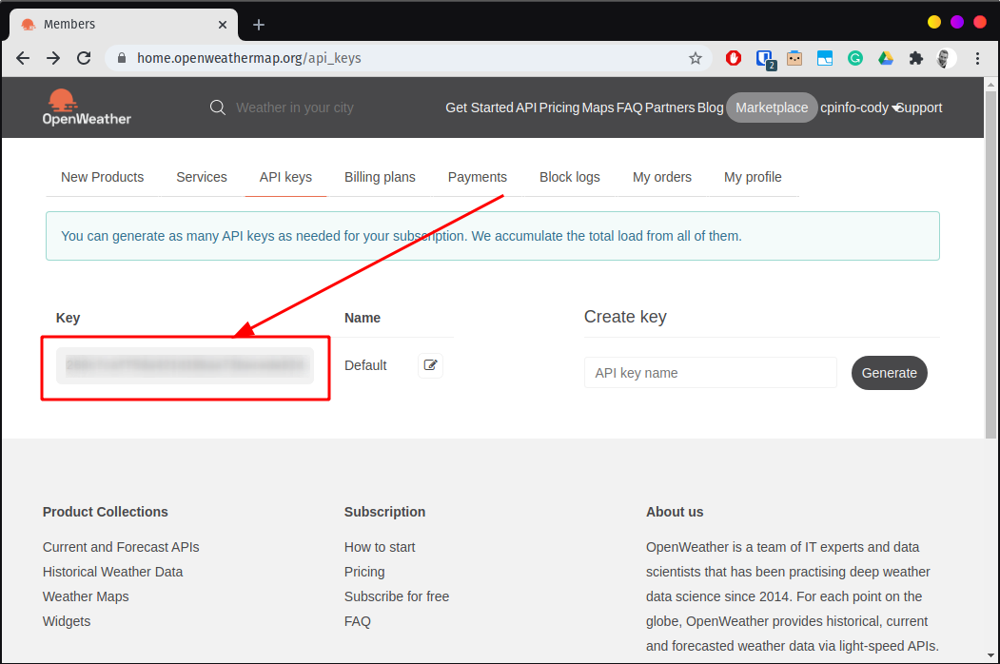
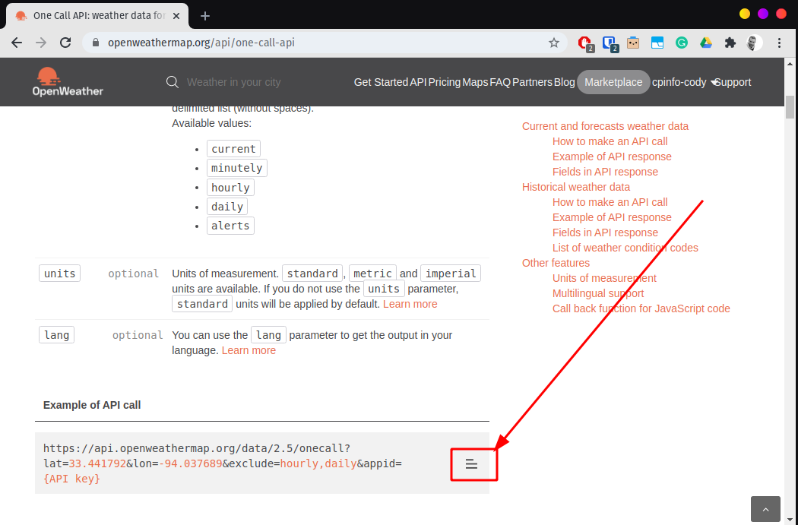
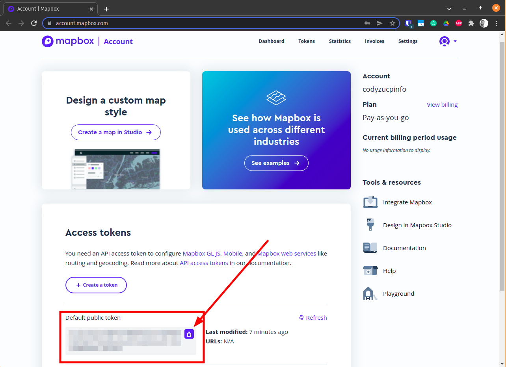

# 🤖 Module 2: APIs

In this module we will practice calling APIs.

When building a web application, you will most certainly need to call some APIs.

* **API** - **A**pplication **P**rogramming **I**nterface
* **REST** - **RE**presentational **S**tate **T**ransaction

**💡Tip: You can either test the APIs with Chrome or wth [Postman](https://www.getpostman.com/) (download from the instructor).**

## 1 OpenWeather ⛈ API

[OpenWeather](https://openweathermap.org/) is service providing APIs providing weather forecasts.

The OpenWeather [One Call API](https://openweathermap.org/api/one-call-api) provides a 7 day weather forecast. The free account allows 1000 requests per day!

### 1.1 Sign up for OpenWeather API
1. Go to [https://home.openweathermap.org/users/sign_up](https://home.openweathermap.org/users/sign_up) and signup for a new account.
1. Confirm your account with the email you received.
1. Login to your account.

### 1.2 Call OpenWeather API
1. Go to your [API keys](https://home.openweathermap.org/api_keys) page and copy your default API key.
   
1. Go the the [One Call API documentation](https://openweathermap.org/api/one-call-api) page and copy one of the sample API calls.
   
1. Test the API call.
   1. In Chrome or Postman, replace `{API key}` with the API key you copied in the previous step.
   1. Add `&lang=fr&units=metric` to the URL to format the data into French.
   1. Remove the portion of the URL `&exclude=hourly,daily` to see all of the data. The `daily` data will be ideal to build our weather application. We could then add `&exclude=minutely,hourly` to see only the daily and current data.
   1. Annecy has a latitude of `45.89911` and longitude of `6.1287`, update your request to get the weather for Annecy.
1. Note your _API key_ for later.

## 2 Mapbox geocoding 🌐 API

The OpenWeather API accepts an exact latitude and longitude coordinate for the weather forecast. If we want to get the weather forecast for location, like `Annecy` or `Lyon`, we need a way to get the geographic latitude and longitude for locations. This is called **geocoding**.

[Mapbox](https://www.mapbox.com/) offers several location and mapping tools, including a **forward geocoding API**. With their free plan we can make 100000 requests per month for free.

### 2.1 Sign up for Mapbox

1. Go to [https://account.mapbox.com/auth/signup/](https://account.mapbox.com/auth/signup/) and signup for an account.
1. ⚠️ Verify your email in the received email message (it could be in your spam folder)
1. Follow the link in the email to your [account page](https://account.mapbox.com/)
1. Copy the Default public token:
   

### 2.2 Call Mapbox API
1. The [mapbox geocoding API documentation](https://docs.mapbox.com/api/search/geocoding/#forward-geocoding) shows how we can make an API request.
1. Open [https://api.mapbox.com/geocoding/v5/mapbox.places/annecy.json?access_token={YOUR_ACCESS_TOKEN}](https://api.mapbox.com/geocoding/v5/mapbox.places/annecy.json?access_token={YOUR_ACCESS_TOKEN}) to see the geocode results for `Annecy`.
1. Look into the response to find the `features[0].geometry.coordinates` to find the longitude and latitude.

#### Exercise 2.1: What is the Latitude and Longitude of Lyon?

#### Exercise 2.2: What is the Latitude and Longitude of your home address?

