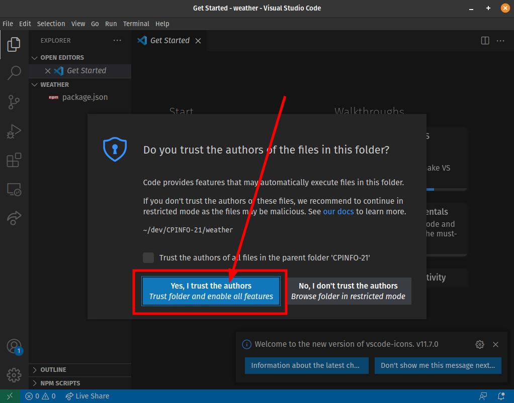
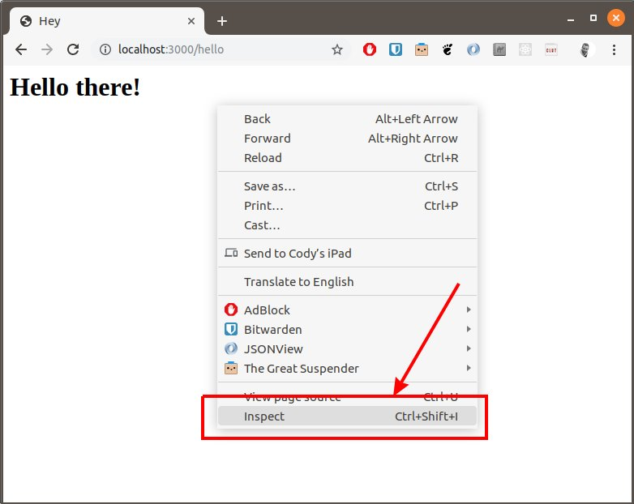
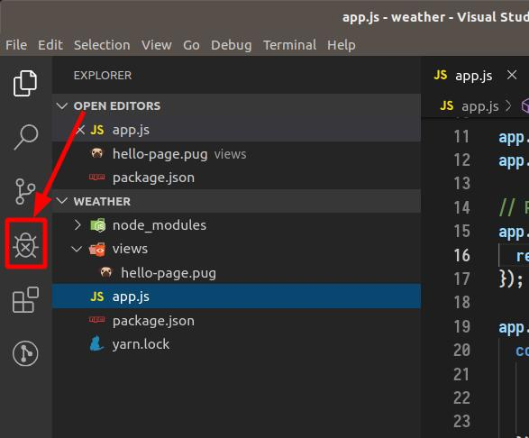
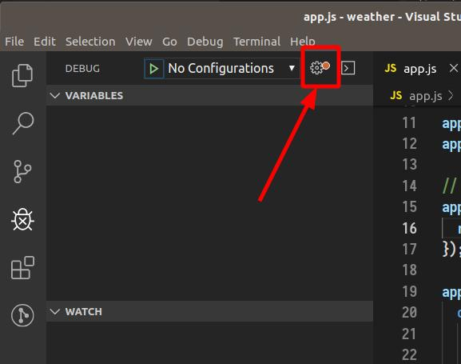
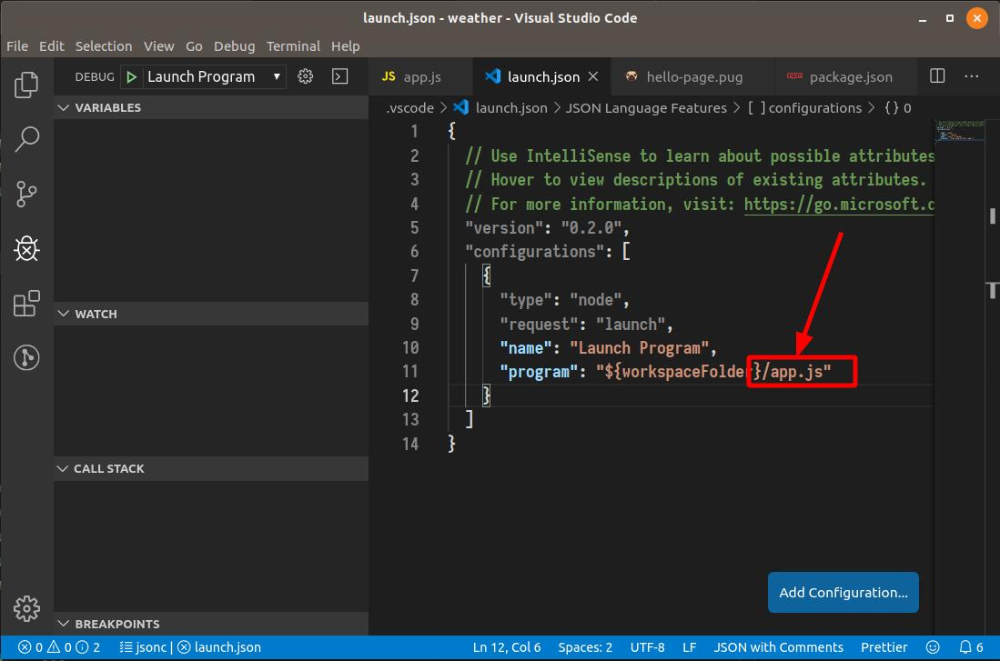
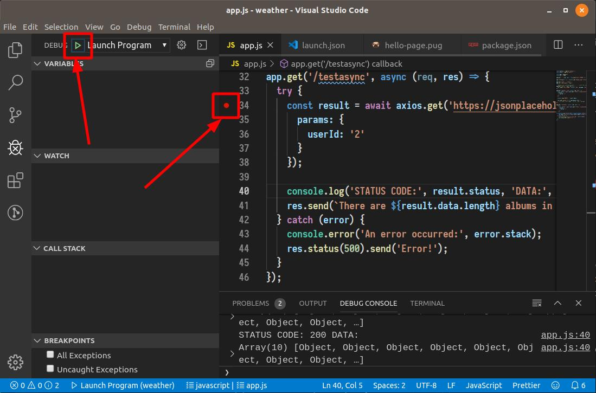

# 🌩 Module 3: Backend - Express server with templates

<!-- There is a working version of this exercise [here](https://cpinfo-m2-express-pug.firebaseapp.com/). -->

<!-- TODO: add screenshots + notes for day 1 exercise -->

<!-- TODO: switch this to esm modules? -->
<!-- TODO: use the ?. operator to remove lodash -->

## 1 Express hello world

```bash
mkdir weather
cd weather

npm init

npm install --save express
```
👉 _Press enter for all of the `npm` questions._

Open the directory in vscode. If prompted by vscode, trust the authors of the files in the folder:



Create the file `app.js`:
```javascript
const express = require('express');
const app = express();
const port = 3000;

app.get('/', (req, res) => res.send('Hello CPINFO!'));

app.listen(port, () => console.log(`Example app listening on port ${port}!`));
```

💡 Tip: Enable VSCode "auto-save" feature to save your files automatically.

Test your server with `node .\app.js` and navigate to [http://localhost:3000](http://localhost:3000).

You can kill your app by pressing `ctrl+c` in the console.

## Bonus

Add nodemon to make it easier to debug your web server.

```cmd
npm install --save-dev nodemon
```

💡 The `--save-dev` switch makes `nodemon` a "development" dependency: a dependency that is not required to use your application, but is required to develop it.

Add the following to your `package.json`:
```json
"scripts": {
  "dev": "nodemon app.js"
}
```

⚠️ _Be sure to keep the correct commas in your `package.json`._

Now run your server with:
```cmd
npm run dev
```

Try modifying the message returned in your server, save the file, and notice the server automatically restarts.

## 2 Server side templates with pug

Follow the [steps to integrate a templating engine](https://expressjs.com/fr/guide/using-template-engines.html) into your express server:

```cmd
npm install --save pug
```

Add to your `app.js`:
```javascript
app.set('views', './views');
app.set('view engine', 'pug');

app.get('/hello', (req, res) => {
  res.render('hello-page', {title: 'Hey', message: 'Hello there!'});
});
```

Create a pug template file in `views/hello-page.pug`:
```pug
html
  head
    title= title
  body
    h1= message
```

⚠️ Be sure to read some of the documentation about the [pug templating language](https://pugjs.org/language/tags.html).

Test your new index page by  navigating to [http://localhost:3000/hello](http://localhost:3000/hello). Open the chrome dev tools and look at the rendered HTML. Notice that the message and title and passed as variables.

Open the chrome dev tools and look at the source file.

<!-- TODO: update screenshot -->


#### Question 2.1: What did the line `h1= message` in index.pug render to in HTML?

## 3 Static Files

Follow the [steps to add static files](https://expressjs.com/fr/starter/static-files.html) into your web server.

Add the following configuration into your `app.js`:
```javascript
app.use(express.static('public'));
```

Add some image files from the internet (3 or 4) into the directory `public/images` of your project.

Test your static files by navigating to [http://localhost:3000/images/abc.jpg](http://localhost:3000/images/abc.jpg)

#### Exercise 3.1: Add a new pug view in `views/originals.pug` that renders an html document that dynamically includes each image in an `img` tag and is served at [http://localhost:3000/originals](http://localhost:3000/originals).

#### Hints:

* pug can iterate over an array of values by using the [`each`](https://pugjs.org/language/iteration.html#each) keyword.
* Using the same mechanism that allowed us to pass the `message` and `title` variables to the template, we can pass an array of image paths.
* You will have to load the image paths using the `fs` module:
  ```javascript
  const fs = require('fs');
  
  // ...

  const imageFiles = fs.readdirSync('./public/images');
  console.log('image files:', imageFiles);
  ```
* The goal is to render an `` tag for each image in your images directory. Refer to the [pug documentation](https://pugjs.org/language/attributes.html) for how to set attributes with pug.

## 4 URL Parameters

We can create URL parameters by using the `:varname` syntax when adding routes to the app.

Inside our route handler, we can then access the value of the variable inside `req.params`. So if our route URL is `/hello/:name` and we navigate to `/hello/cody` in our browser then `req.params.name` is automatically set to `'cody'`.

#### Exercise 4.1 Create a new pug view at `views/weather.pug` that is served with with the url `/weather/:city` and displays a message 'Weather for {CITY_NAME}' where CITY_NAME is the value of the parameter passed in the URL.

## 5 Calling APIs

Install [node-fetch](https://github.com/node-fetch/node-fetch) into your project:
```cmd
npm install --save node-fetch@2
```

ℹ️ The `@2` installs the version 2 of `node-fetch`, that is compatible with commonjs.

`node-fetch` will let us call other APIs.

Add node-fetch to the require statements at the top of `app.js`:
```javascript
const express = require('express');
const fetch = require('node-fetch');

// ...
```

Calling an API is "asynchronous", meaning the request happens in the background and our code will be notified when it is complete. node-fetch will let us make API requests using `promises` or `async/await` (this has the advantage of letting us use `try/catch` syntax for error handling).

To use `async/await` with express, we will have to make our handler `async`, allowing us to `await` for asynchronous functions.

To call the api https://jsonplaceholder.typicode.com/albums?userId=2 with node-fetch we can do the following:

```javascript
app.get('/testasync', async (req, res) => {
  try {
    const params = new URLSearchParams({userId: 2});
    const result = await fetch(`https://jsonplaceholder.typicode.com/albums?${params}`);
    const albums = await result.json();

    console.log('STATUS CODE:', result.status, 'DATA:', albums);
    res.send(`There are ${albums.length} albums in the result.`);
  } catch (error) {
    console.error('An error occurred:', error.stack);
    res.status(500).send('Error!');
  }
});
```

#### Exercise 5.1 Update your `/weather/:city` route to display the 7 day weather forecast for any city. 

#### Hints:
* A basic algorithm looks like this:
  1. fetch the geographical latitude and longitude from the **here API**
  2. parse the longitude and latitude from the response
  3. fetch the weather for the longitude and latitude with the **OpenWeather API**
* Remember that pug can iterate over an array of values by using the [`each`](https://pugjs.org/language/iteration.html#each) keyword (i.e. you should iterate over the 7 forecast days)
* The timestamps inside the OpenWeather weather response are in Linux epoch seconds time. JavaScript works with milliseconds. We can parse and format a seconds timestamp like this:
  ```javascript
  const time = 1572562800;
  const timeString = new Date(forecast.time * 1000).toLocaleString();
  ```
  Note the same can be done inside a pug template:
  ```pug
  html
    body
      p The time is #{new Date(time * 1000).toLocaleString()}
  ```
  💡Alternatively, you can use [moment.js](https://momentjs.com/) to parse and format date and times.
* 🚀 **BONUS**: Consider adding some fancy icons! Openweathermap has icon codes and built in icons: https://openweathermap.org/weather-conditions#How-to-get-icon-URL

<!--
```text
  html
  head
    script(src='https://cdn.jsdelivr.net/npm/feather-icons/dist/feather.min.js')
  body
    p
      i(data-feather='cloud-lightning')
      |
      | Today it is raining!

    script feather.replace({width: '1em', height: '1em'})
  ```
-->

* 🚀 **BONUS**: Consider add some style with CSS:
  * You can do ["inline" styling in pug](https://pugjs.org/language/attributes.html#style-attributes) if you are a CSS guru.
  * Alternatively, consider adding [bootstrap](https://getbootstrap.com/) (or another CSS library) to do something fancy!

## Bonus: Debugger 🚫🐛

In Visual Studio Code:
* Open the debugger panel:
  
  
* Open the launch config:
  
  
* Configure the debugger to open our `app.js` file:
  
  
* Set a breakpoint in the code and start the debugger:
  
  
* Refresh the browser and see the application break at the breakpoint. You can inspect the local variables, update values, and step through the code.
* ⚠️ If you application is running in the console, be sure to kill it before starting the debugger.

