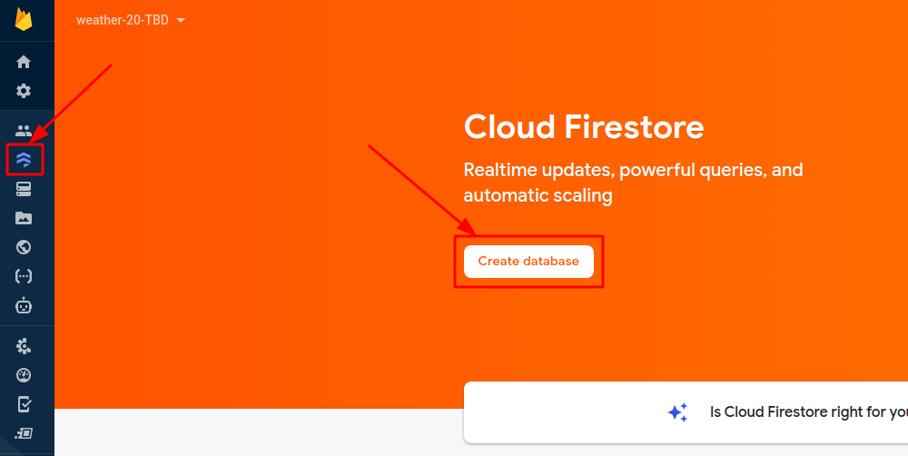
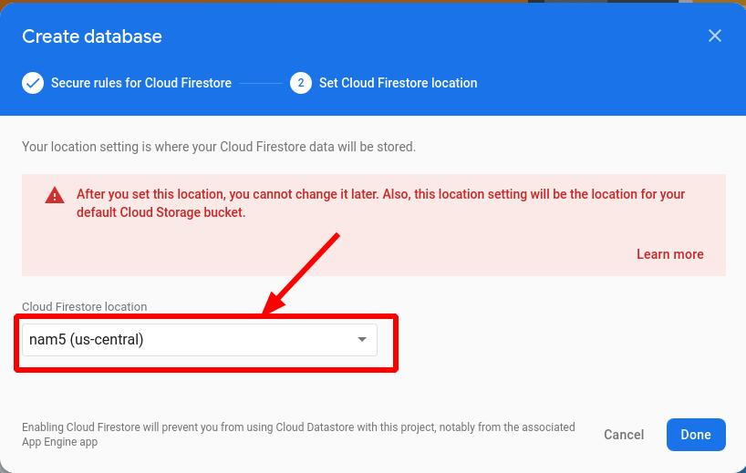
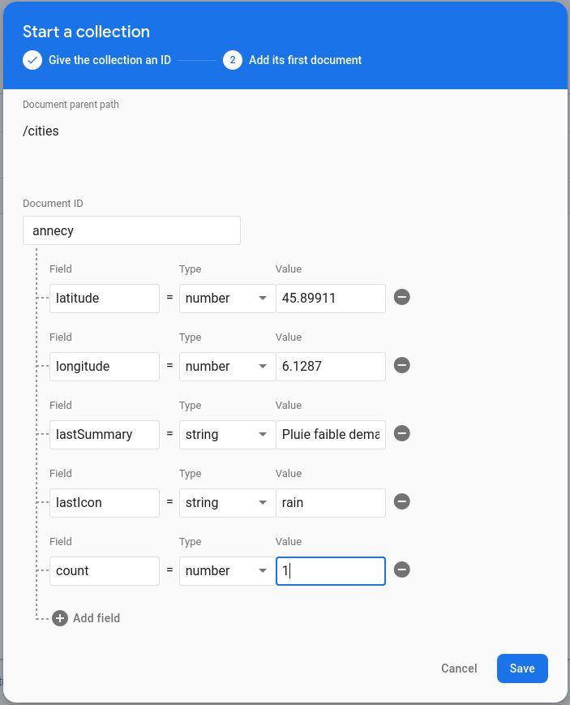
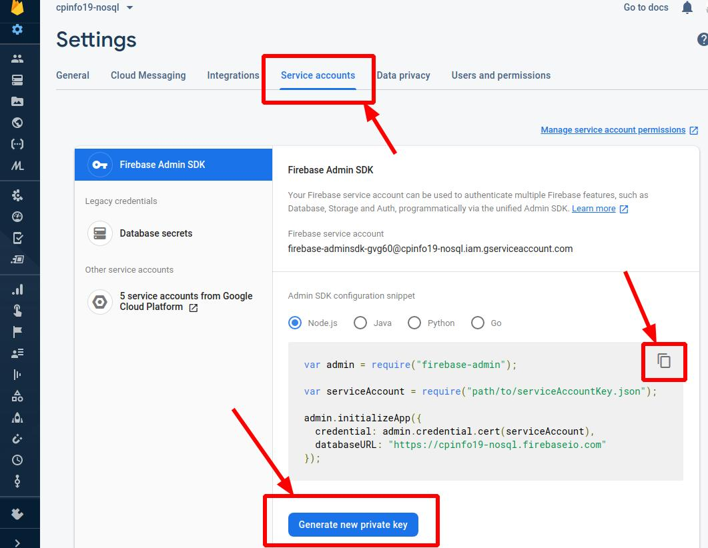

# Firebase Cloud Firestore

⚠️ **Register your Free GCP Coupon from the instructor!**

⚠️ ⚠️ You must use your IUT Google account for you coupon to work ⚠️ ⚠️

https://www.iut-acy.univ-smb.fr/ 👉 Intranet 👉 Resources Informatiques 👉 Offres Logiciel 👉 Plateforme Google

## 1 Adding admin access to Firestore to express

1. [https://console.firebase.google.com](https://console.firebase.google.com)

1. Sign in to your **IUT** google account

1. "Add project"

1. Give your project a unique name, i.e. "weather".

1. Disable Google Analytics (we won't be using them).
   

1. Click "Create project".

1. In the firebase web console, navigate to "Firestore Database" and click "Create Database"

   

1. Choose "Start in test mode". _⚠ Note the security warning: **your database is open for anyone to read/write!**_ Click "Create project".

   

1. Use the default `nam5 (us-central)` location and click "Done":
   

1. Click on "Start collection"

1. Give the collection the name `cities` and click "Next".

1. Collections only exist if they contain documents. Therefore, we are required to create an initial document.
   * We will use the city name as the.
   * The document should store enough information to show some the most recent searches and a count.
   * Click "Save" to store the first document
  
   

1. Optionally add some more documents.

1. In the Firebase console, click on the setting gear then "Project settings"

   

1. Click on the "Service accounts" tab, click "Generate new private key" and store the key in the root of your project. Finally, click the button to copy the code snippet and paste it to your `app.js` file in your weather project.

   

1. Add firebase-admin to your project:
   ```cmd
   npm install --save firebase-admin
   ```

Now we can access the [admin Firestore API](https://googleapis.dev/nodejs/firestore/latest/Firestore.html):
```javascript
const citiesCollection = admin.firestore().collection('cities');
```

Be sure to also read the [Firestore Documentation](https://firebase.google.com/docs/firestore).

#### Exercise 1.1: Update an associated city whenever a weather query occurs.

#### Exercise 1.2: Add a new route into your express server to display (with a pug template) the most popular cities ordered by most popular, i.e. `/popular`.
