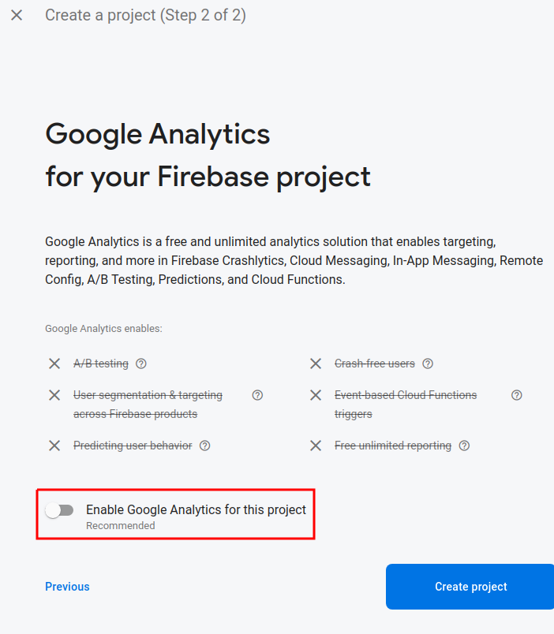

# Deploy the application to Firebase

We will now deploy our weather app to the cloud. However there are 2 parts to the app. The react client and your API server.

The react client will be deployed to Firebase Hosting as a static site. A static site is simply a location to store the html, javascript, and css that make up our react application.

The weather API that we created will be deployed to a Serverless Function. We will only deploy the route that fetches the weather for the city and returns daily weather data as JSON.

## 1 Firebase Project

### 1.1 Create a new Firebase Project

1. [https://console.firebase.google.com](https://console.firebase.google.com)
1. Sign in to your **university** google account
1. "Create a project"
1. Give your project a unique name and select the university parent organization:

   

1. Disable google analytics:

   

## 1.2 Add Firebase into your project

1. Start in the root of your `weather-app` project (the same directory as your `package.json` file).

1. Build your react project:
   ```cmd
   npm run build
   ```
   _Note: you now have a `build` directory containing the files required to deploy your application._

1. Add the firebase-tools package
   ```cmd
   npm install --save-dev firebase-tools
   ```

1. Add a npm run-script to make it easier to run.

   `package.json`:
   ```javascript
   // ...

   "scripts": {
     // ...
     "firebase": "firebase"
   },

   // ...
   ```

1. Login to Firebase:
   ```cmd
   npm run firebase -- --help
   npm run firebase -- login
   ```

## 2 Hosting your react site

1. Enable Firebase hosting:
   ```cmd
   npm run firebase -- init
   ```
   1. Enable `Hosting` with the space bar and then press enter.
   1. _"Select a default Firebase project for this directory"_ select `don't setup a default project` and press enter
   1. ⚠️ ☣️ **DO NOT SKIP THIS STEP** ☣️ ⚠️️ _"What do you want to use as your public directory? (public)"_: **enter `dist`**, the directory containing your built react application.
   1. _"Configure as a single-page app (rewrite all urls to /index.html)?"_: **enter `y`** because our react application is a single page application.
   1. _"Set up automatic builds and deploys with GitHub?"_ **enter `n`**.
   1. _"File build/index.html already exists. Overwrite?"_: **enter `n`** since we want to use the `index.html` generated by the react build process.

   💡 _Note that Firebase added 2 new files, `.firebaserc` that remembers which firebase project to use by default and `firebase.json` that contains some firebase settings, including those that you configured above._

1. Link your local project to your Firebase project:
   ```cmd
   npm run firebase -- use --add
   ```
   1. _" Which project do you want to add?"_ **select the project you create before and press enter**
   1. _"What alias do you want to use for this project? (e.g. staging)"_ **enter `default` and press enter**

1. Deploy your application!
   ```cmd
   npm run firebase -- deploy
   ```

1. Navigate to the URL provided by firebase in console. It should resemble: `https://{your project name}.web.app`

   Try accessing your site with smartphone. You just deployed your first site, with SSL, to the cloud... for free!

1. In your browser, in the Firebase console, go to the "Hosting" page. Here you could associate a custom domain. You can also see your deployment history with the option to rollback to a previous deployment.

#### Exercise 2.1 Update your site and redeploy. Use the Firebase console to roll back your deployment.

## 3 Add serverless functions to your project

1. Enable Firebase functions:
   ```cmd
   npm run firebase -- init
   ```
   
   1. Choose "Functions"
   1. Select "JavaScript"
   1. "Do you want to use ESLint to catch probable bugs and enforce style?" **enter `n`**
   1. "Do you want to install dependencies with npm now?" **enter `n`**

1. Modify your functions to use the [node.js version 16 runtime](https://firebase.google.com/docs/functions/manage-functions#set_nodejs_version).

   In `functions/package.json` modify the `engines` entry:
   ```
   "engines": {
     "node": "18"
   },
   ```

1. Install the dependencies with npm:
   ```cmd
   cd functions
   npm install
   ```

1. In vscode, open `functions/index.js` and **un-comment** all of the lines of code. Then rename the function to `weather`:

   ```javascript
   exports.weather = functions.https.onRequest((request, response) => {
   functions.logger.info("Hello logs!", {structuredData: true});
   response.send("Hello from Firebase!");
   });
   ```

1. Open the `/firebase.json` file. Add a rewrite rule so that you function is accessible in the same domain as your hosting. Your rewrite rules should resemble the following:
   ```json
   "rewrites": [
     {
       "source": "/api/weather",
       "function": "weather"
     },
     {
       "source": "**",
       "destination": "/index.html"
     }
   ]
   ```

1. Re-deploy your project **⚠️ from the root of your project ⚠️**:
```cmd
cd ..
npm run firebase -- deploy
```

1. ⚠️ You will get an error message the first time you deploy your function:

   > Error: Your project weather-cpinfo20 must be on the Blaze (pay-as-you-go) plan to complete this command.

   Follow the link and add purchase the firebase "Blaze" plan using the billing account created with the free credits that you received from Google Cloud.

   

   After upgrading the project, re-execute `npm run firebase -- deploy`.

1. You just deployed your first serverless cloud function! You can access either directly in the URL listed in the console:
   
   `https://us-central1-{your project name}.cloudfunctions.net/weather`

   Or at the path that we configured in the hosting _(notice the path is `api`)_:

   `https://{your project name}.web.app/api/weather`

   ☝️ Take a moment to appreciate what we now have. A website deployed, with javascript backend configured to exact routes. **Plus, we never configured a server, virtual machine, docker, or paid for hosting!**

💡 The function `onRequest()` works the same way as a route in express with the `request` and `response` parameters.

#### Exercise 3.1 Copy your `getWeather()` function from your express app into `functions/index.js` and call it from the weather function:

```javascript
const functions = require('firebase-functions');

exports.weather = functions.https.onRequest(async (request, response) => {
  const city = request.query.city;
  functions.logger.info("Getting weather for city", {city});
  const weather = await getWeather(city);
  functions.logger.info("Fetch weather data", {weather});
  response.send(weather);
});

async function getWeather(city) {
  // Your getWeather() function...
  
  // 1. get long/lat for city
  // 2. get weather for long/lat
  // ...
}
```

* ⚠️ Notice the `async` keyword was added to the function!
* 💡 The city should be passed as a query param, i.e. `/api/weather?city=annecy`. It can be accessed in the function in `request.query.city`. [Firebase docs](https://firebase.google.com/docs/functions/http-events#read_values_from_the_request)
* 🐛 🔍 You can host the react client and serverless functions locally using the firebase emulators:
   ```cmd
   npm run firebase -- emulators:start
   ```
* Once working, redeploy the project:
   ```cmd
   npm run firebase -- deploy
   ```
* Logs from deployed functions can be viewed in the firebase console at https://console.firebase.google.com and opening the functions:
   

#### Bonus: Use firestore in your app to track recent cities and or provide accounts to remember the previous city.

#### Bonus: Use next.js, gatsby, or react-router to create multiple pages in your app
